# Cloud Security Assessment using Prowler

### Overview

This project demonstrates a complete Cloud Security Assessment Lifecycle using Prowler to evaluate and improve the security posture of an AWS Free Tier environment.

The assessment covered core AWS services including IAM, EC2, Amazon S3, CloudTrail, and AWS Lambda. Security findings were analyzed, prioritized based on severity, remediated where feasible, and validated through a follow-up assessment.

The project also documents risk acceptance decisions for findings that could not be remediated due to AWS Free Tier limitations.

---

### Objectives

- Assess AWS security posture using Prowler
- Identify cloud security misconfigurations
- Prioritize findings by severity
- Remediate security weaknesses
- Validate remediation through reassessment
- Document accepted risks
- Improve overall cloud security posture

---

### Lab Environment

| Component | Details |
|-----------|---------|
| Cloud Provider | Amazon Web Services (AWS) |
| Assessment Tool | Prowler |
| Operating System | Kali Linux |
| Container Platform | Docker |
| AWS Account | AWS Free Tier |

---

### In-Scope Cloud Services

- AWS Identity and Access Management (IAM)
- Amazon EC2
- Amazon S3
- AWS CloudTrail
- AWS Lambda

---

### Tools & Technologies

- AWS Free Tier
- Prowler
- Docker
- Kali Linux
- AWS CLI
- IAM
- EC2
- S3
- CloudTrail
- Lambda

---

### Assessment Methodology

1. AWS Environment Setup
2. AWS CLI Configuration
3. Prowler Installation
4. Initial Security Assessment
5. Findings Analysis
6. Remediation
7. Reassessment
8. Risk Acceptance Documentation

---

### Security Assessment

The initial assessment evaluated:

- Identity and Access Management
- Storage Security
- Logging and Monitoring
- Encryption
- Security Groups
- Compliance Best Practices
- Cloud Configuration

---

### Major Findings

The assessment identified findings across:

- IAM accounts
- EC2 Security Groups
- Amazon S3 Bucket
- CloudTrail 
- AWS Lambda 

Findings were categorized into:

- Critical
- High
- Medium
- Low

---

### Remediation Activities

Security improvements included:

- Restricting overly permissive Security Groups
- Enabling Virtual MFA for IAM users
- Blocking Public S3 Bucket Access
- Removing Public ACLs
- Improving IAM security configurations
- Applying AWS security best practices

---

### Assessment Results

| Severity | Initial | Reassessment |
|-----------|--------:|-------------:|
| Critical | 4 | 2 |
| High | 18 | 9 |
| Medium | 110 | 91 |
| Low | 87 | 76 |

### Security Posture Improvement

- 37 fewer failed security checks
- 43 additional passed security checks
- 50% reduction in Critical findings
- 50% reduction in High findings

---

### Risk Acceptance

Some findings were intentionally accepted because they exceeded the project scope or AWS Free Tier limitations.

Examples include:

- Hardware MFA
- AWS KMS Customer Managed Keys
- AWS Organizations
- SNS/SQS integrations
- CloudWatch enhancements

These decisions are documented with appropriate justification in the project report.

Risk Acceptance and Limitations document is also availabe here:


---

### MITRE / Security Best Practices

The project demonstrates implementation of:

- Principle of Least Privilege
- Multi-Factor Authentication
- Security Group Hardening
- Secure Cloud Storage
- Cloud Logging
- Security Posture Management
- Risk-Based Remediation

---

### Project Structure

```
AWS-Prowler-Cloud-Security-Assessment/

│
├── README.md
│
├── report/
│   └── prowler-cspm.pdf
│
├── screenshots/
│   ├── architecture.png
│   ├── aws.png
│   ├── prowler.png
│   ├── assessment1.png
│   ├── assessment2.png
│   └── result-comparison.png
│
├── commands/
│   ├── prowler-commands.md
│   └── aws-cli.md
│
└── risk-acceptance.md
```

---

### Screenshots

#### AWS Environment

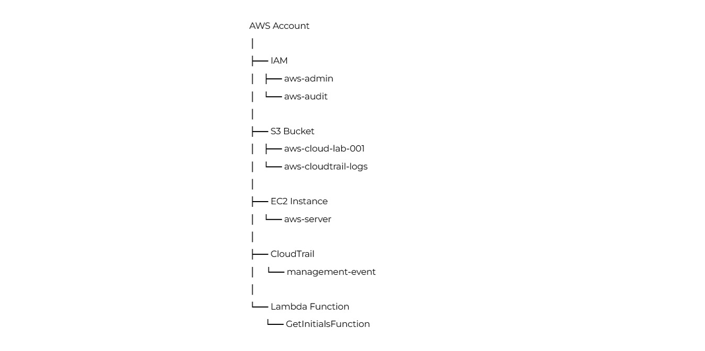

---

#### AWS Setup

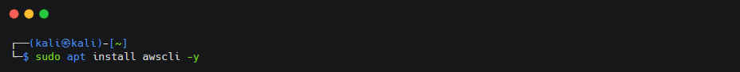
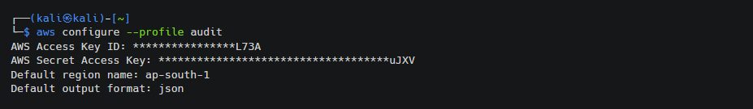
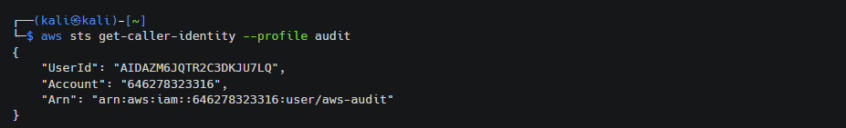

---

#### Prowler Setup

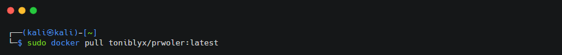
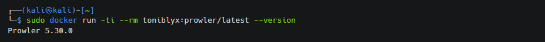

---

#### Initial Assessment

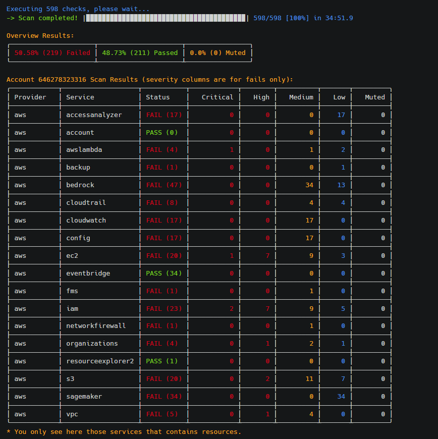
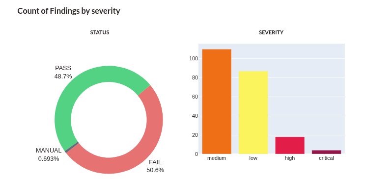

---

#### Final Assessment

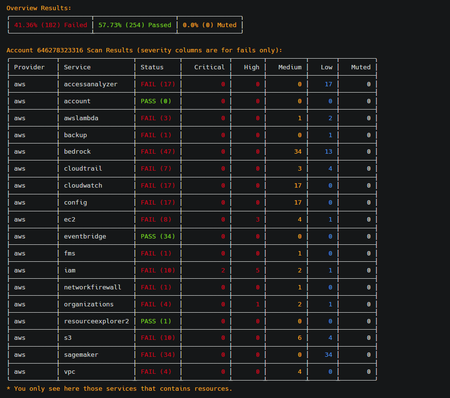
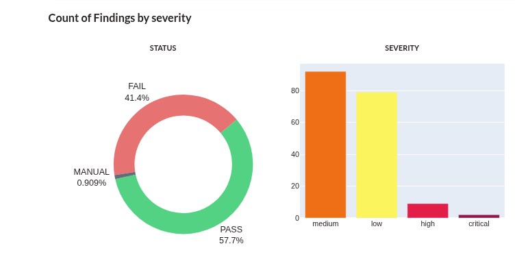

---

#### Result Comparison

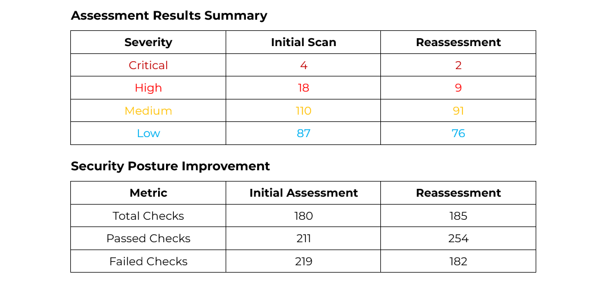
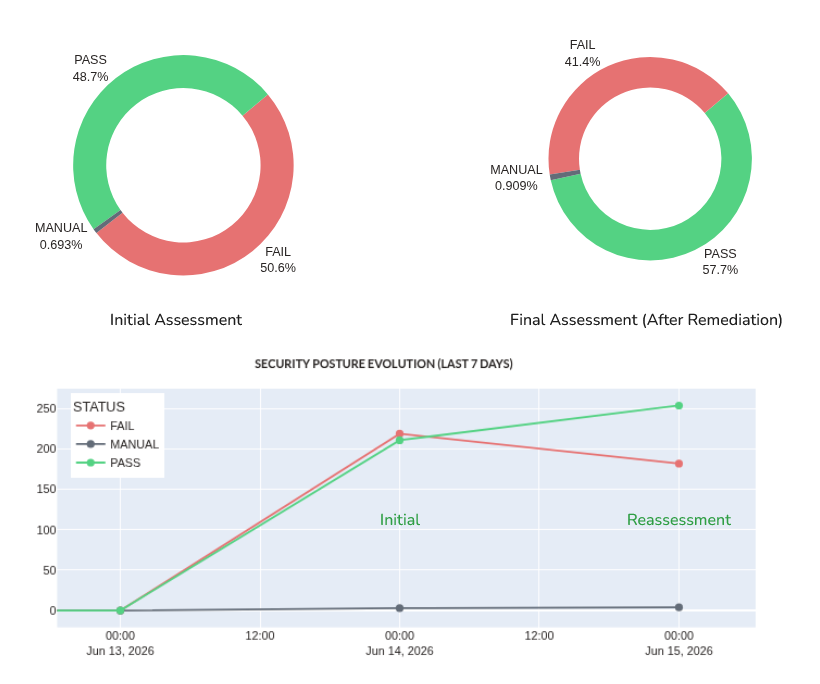

---

### Results

The project successfully demonstrated a complete cloud security assessment lifecycle.

Key achievements include:

- Identified cloud security misconfigurations
- Prioritized findings based on risk
- Applied security best practices
- Improved AWS security posture
- Validated remediation through reassessment
- Documented accepted risks within project constraints

---

### Skills Demonstrated

- Cloud Security
- AWS Security
- Cloud Security Posture Management (CSPM)
- Prowler
- IAM Security
- EC2 Security
- Amazon S3 Security
- CloudTrail
- Docker
- AWS CLI
- Risk Assessment
- Security Hardening
- Remediation Validation

---

### Documentation

The complete project report—including setup, methodology, findings analysis, remediation, reassessment, screenshots, and conclusions—is available in:


---

### Author

**Aditya Yadav**

Mechanical Engineer transitioning into Cybersecurity with hands-on experience in Cloud Security, Vulnerability Management, SIEM, Detection Engineering and AWS Security.
